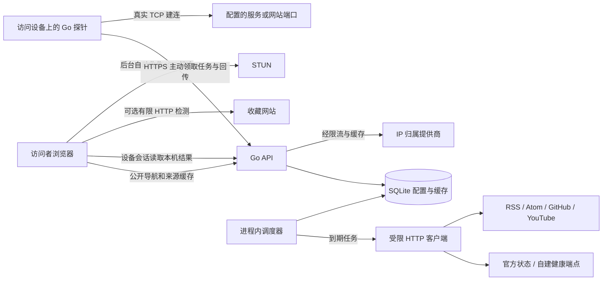

# KitonyNav v0.0.2 技术框架与接口草案

状态：已实施第一版的技术框架；allowlist 本机探针已提供，探针配对协议、生产化 provider 和部分目录拆分仍是后续工作。
日期：2026-09-11。需求、阶段与验收见 [开发计划](./v0.0.2-plan.md)。

## 1. 复用边界与数据流

保留 Vite + React 前端、Go 单进程 API、SQLite WAL、现有会话/CSRF 和导航 CRUD。当前业务集中在 `src/App.tsx` 与 `server/main.go`，按本次功能逐步提取；不先搬空整个项目，也不引入微服务、Redis 或新的前端状态管理库。



公开导航与官方状态可以共享缓存；设备探针结果和 IP 信息通过独立私有端点读取，不能放入当前 `Cache-Control: public` 的 bootstrap 响应。

## 2. 建议目录与责任

下列文件随对应阶段逐个建立；原 `src/data.ts`、`src/api.ts` 可作为兼容导出入口，避免一次重写全部调用方。

```text
src/
  App.tsx                         路由与页面组装
  components/
    icons/ItemIcon.tsx             分类、链接统一图标渲染
    icons/IconPicker.tsx           图标选择与即时预览
    Brand.tsx                     页面品牌资源
  features/
    appearance/                   主题偏好、时钟预设与编辑面板
    monitoring/                   服务设置、状态面板、连通性徽标
    subscriptions/                订阅管理、源状态、动态列表
    network/                      WebRTC、HTTP 观测、底部信息
    probe/                        配对状态、当前设备结果
  lib/
    contracts.ts                  API 类型、能力与来源定义
    preferences.ts                设备偏好校验和旧键迁移
  api/                            按功能调用 API，复用鉴权请求封装
  data.ts                         兼容数据类型/明确的演示数据
  styles.css                      保留现有变量和响应式基底
public/
  brand/                          同源品牌图像和 favicon
server/
  main.go                         现有入口和旧业务按需保留
  migrations.go                   有序、事务化的 SQLite 迁移
  monitoring.go                   服务管理 API / store 接入
  subscriptions.go               订阅管理 API / store 接入
  network.go                     IP 观测、provider 接入
  probe.go                       设备配对、任务租约与结果 API
  internal/
    fetcher/                     URL/DNS/重定向/大小边界
    monitor/                     状态源适配器与纯 TCP 检测器
    feeds/                       RSS/Atom、GitHub、YouTube 适配器
    scheduler/                   到期执行、取消、退避与限并发
    probe/                       探针协议、任务与结果校验
  cmd/kitonynav-probe/main.go     独立本机探针入口，复用同一 Go module
```

测试随模块保留在 `*.test.ts`、`*_test.go`；RSS/状态页固定样本放相应测试目录。探针不能依赖 `package main` 或 SQLite，TCP 逻辑放在可复用 internal package。现有 `go run .` 和 Docker 服务端入口继续有效。

`.openai/hosting.json`、`worker/index.js`、`scripts/prepare-sites-build.mjs`、`tests/sites-worker.test.mjs` 保持现有用途，不把探针或 Go API 塞入 Sites 静态 Worker。

## 3. 数据契约

### 3.1 监控配置与结果分离

一个服务配置包含名称、排序、启停、公开状态源和可选本机 TCP 目标；官方状态源不是必须项。收藏网站从 URL 推导 TCP host/port，也可关闭检测。

```ts
type ThemePreference = "system" | "light" | "dark";
type IconSpec =
  | { kind: "builtin"; value: string }
  | { kind: "url"; value: string };

type ServiceConfig = {
  id: number;
  name: string;
  enabled: boolean;
  sortOrder: number;
  healthSource?: {
    kind: "statuspage" | "http" | "json";
    url: string;
    // 仅声明式状态映射/组件选择；不接受用户脚本。
    options: Record<string, unknown>;
    intervalSeconds: number;
  };
  tcpTarget?: { host: string; port: number; timeoutMs: number };
};

type ConnectivityResult = {
  targetType: "service" | "link";
  targetId: number;
  targetRevision: number;
  origin: "device-probe" | "browser-http";
  method: "tcp" | "http";
  state: "reachable" | "unreachable" | "unknown" | "unsupported";
  reason?: string;                 // timeout、dns、refused、browser-restricted 等
  durationMs?: number;             // 由 method 决定含义，失败不造数值
  checkedAt: string;               // UTC ISO 8601
  expiresAt: string;
};
```

服务健康结果独立使用 `online/degraded/offline/unknown`，带 `sourceKind/sourceUrl/checkedAt/lastSuccessAt/errorCode`。传输失败或解析失败产生 unknown 或“上次结果已过期”，不据此断言官方全站故障。保存新配置时递增 revision，使旧目标的缓存和在途任务结果失效。

“检查中”是请求状态，“已停用”是配置状态，“过期”由时间派生，不继续扩张成混合枚举。UI 不只用颜色传达结果，数值 0ms 也应正确展示。

### 3.2 持久化模型

| 数据 | 建议存储 | 最小字段 / 约束 |
| --- | --- | --- |
| 有序迁移 | 新建 `schema_migrations` | version 主键、applied_at；单次迁移和版本写入同事务。 |
| 服务配置 | 新建 `service_monitors` | name、enabled、sort_order、health_type/url/options、tcp_host/port、timeout_ms、interval_seconds、revision。 |
| 服务来源缓存 | 新建 `service_health_cache` | monitor_id 唯一、状态、来源、检查/成功时间、错误、过期时间；与配置外键关联。 |
| 订阅配置 | 新建 `subscriptions` | type、name、url 或规范化 source_ref、enabled、sort_order、interval_seconds、ETag、Last-Modified、last_checked/success_at、last_error。 |
| 真实动态 | 新建 `feed_items` | subscription_id、external_id、title、url、published_at、fetched_at；唯一 `(subscription_id, external_id)`，发布时间索引。 |
| 链接检测配置 | 扩展 `links` | connectivity_enabled、可选 probe_port、revision；无端口覆盖时使用 URL 明示端口或 HTTP 80 / HTTPS 443。 |
| 图标 | 扩展 categories/links | 保留原 icon key，新增 icon_kind 与 icon_url；旧数据映射到 builtin，folder 默认 key 补齐。 |
| 站点默认外观 | 现有 settings KV | 有类型校验的 theme_default、clock_defaults、品牌资源引用；不放设备覆盖值或凭据。 |
| 探针注册 | 新建 `probes` 与设备绑定表 | id、展示名、token_hash、last_seen_at、revoked_at、绑定会话哈希；一次性配对码仅短时有效。 |
| 探针任务/结果 | 有界 `probe_jobs` / `probe_results` | probe_id、target_id/type/revision、租约、过期时间、状态与耗时；设备隔离、定期清理，不积累无限历史。 |
| IP 观测 | 默认仅设备状态/内存缓存 | 原始 ICE 候选不持久化；归属查询缓存有 TTL，日志不记录完整 IP。 |

旧 services/updates 表保留作为 legacy，不删除、不自动补造目标或日期；新 API 读取新表，新配置默认空列表，管理员看到待配置状态。确认属于演示的旧条目不再作为实时健康结果渲染。

迁移先针对旧库副本验证；新增字段采用兼容默认值。SQLite 当前限制一个连接，抓取与网络等待必须在事务外完成，写缓存用短事务。在线备份使用 SQLite 一致性备份方式，或停服务并正确处理 WAL 后备份；不可在写入期间只复制主 `.db` 文件。回滚恢复升级前备份，避免破坏新格式数据。

### 3.3 Bootstrap 与个人状态

bootstrap 增量提供 `schemaVersion`、公开 capabilities、站点外观默认值以及服务/订阅摘要。保留 v1 路由，旧导航字段继续兼容；过渡期旧 services/updates 返回诚实的 unknown/空数据，不给演示值贴实时标签。

capabilities 区分服务配置、订阅、探针代理和网络查询是否由当前后端提供。探针“此设备是否在线”不属于公开 capability，通过设备端点查询。

前端失败状态调整：初次断网可显示明确的本地导航/演示模式；已取得真实数据后临时失败保留最后成功导航，监控标过期。静态 Sites 缺少后端时禁用保存/真实刷新并解释原因。API 故障不能无提示切回固定正常状态。

## 4. API 草案与权限

以下是路由责任草案，实施时按现有 JSON 命名与错误封装统一。新增设置更新使用分区 payload，防止一次保存外观覆盖监控/网络配置；读取设置包括合法默认值，非法参数返回明确错误。

| API | 用途 | 权限 / 缓存 |
| --- | --- | --- |
| `GET /api/v1/bootstrap` | 导航、品牌、站点默认外观、公开模块摘要与 capabilities | 公开，延用 ETag；排除 IP、探针 token、设备结果及私有端点。 |
| `GET /api/v1/admin/services`；`POST /api/v1/admin/services`；`PUT/DELETE /api/v1/admin/services/{id}` | 完整服务配置、启停和排序 | 管理员；所有写操作使用现有 CSRF；目标/凭据不混入公开配置。 |
| `POST /api/v1/admin/services/{id}/refresh` | 请求重新抓取服务健康来源 | 管理员 + CSRF；只处理已保存 ID，限流并合并重复请求，返回 202/任务状态。 |
| `GET /api/v1/services` | 全部可公开的服务健康缓存 | 公开只读，过滤配置细节；读取不直接触发外部抓取。 |
| `GET/POST /api/v1/admin/subscriptions`；`PUT/DELETE /api/v1/admin/subscriptions/{id}` | 订阅管理 | 管理员，写操作 CSRF；停用保留缓存、删除关联真实条目。 |
| `POST /api/v1/admin/subscriptions/test`；`POST /api/v1/admin/subscriptions/{id}/refresh` | 保存前校验源与手动刷新 | 管理员 + CSRF；同一受限 fetcher，不另开任意 URL 公共代理。 |
| `GET /api/v1/updates?subscriptionId=&cursor=&limit=` | 动态分页与具体源筛选 | 公开只读，仅返回启用源；limit 有上限，稳定分页键。 |
| `PATCH /api/v1/admin/settings/{section}` | 站点外观、品牌、网络默认项分区保存 | 管理员 + CSRF；密钥只接受引用/是否已配置状态，不回显明文。 |
| `POST /api/v1/admin/probes/pairings`；`POST /api/v1/probes/enroll` | 当前设备发起短期配对、探针一次性领取凭据 | 发起需管理员 + CSRF；enroll 只接受一次性高熵配对凭证，限流；一次消费。 |
| `POST /api/v1/probes/jobs/poll`；`POST /api/v1/probes/jobs/{id}/result` | 探针主动长轮询、回传结果 | 独立设备 bearer token；不使用浏览器管理 cookie，约束到自身租约任务。 |
| `POST /api/v1/device/connectivity/refresh`；`GET /api/v1/device/connectivity` | 当前浏览器触发已配置目标检测、读取本机结果 | 独立设备会话；写操作 CSRF，限流；`private, no-store`。 |
| `DELETE /api/v1/admin/probes/{id}` | 撤销探针与绑定、作废未完成任务 | 管理员 + CSRF；设备状态随即不可用。 |
| `GET /api/v1/network/client` | 当前 HTTP 请求所观测的 IP | 不进入共享缓存，`private, no-store`，限流。 |
| `POST /api/v1/network/lookup` | 查询设备提交的有效公网 IP 的归属 | 同源短期设备上下文 + CSRF/Origin 检查、限流、固定 provider；不接收 URL。 |

管理员公开导航、设备配对、探针 machine credential 是不同的授权范围。不能只提交一个 probeId 就读到其他设备结果；不能允许探针 token 编辑导航配置。普通访客若启用 IP 查询，可签发无管理权限的短期同源上下文，不要求取得后台权限。

## 5. 监控与本机探针

### 5.1 服务健康来源

当前代码已接入 HTTP 健康端点和 TCP 建连检查；Statuspage 风格公开 API、自建 JSON 字段映射属于下一步适配。Statuspage 适配应保留原状态页链接；JSON 仅允许有限字段路径和状态值映射，不执行代码。官方 API 接入方式可参考 [GitHub Status API](https://www.githubstatus.com/api)。

配置同一对象时可同时关注健康来源和本机 TCP 目标；健康端点的服务器请求来源标为“服务器检查”，官方结果标为“官方状态”，两者均与“本机 TCP”分栏。TCP 成功只说明端口可连接，不能证明登录、页面加载或应用业务正常。

### 5.2 探针闭环

1. 管理员在访问设备的浏览器创建一次性配对；探针凭此注册，绑定此浏览器的设备会话。探针 token 存在设备受限配置文件，服务端仅保存哈希；不把管理密码交给探针。
2. 探针主动 HTTPS 长轮询，服务器按当前已保存目标生成有过期时间和租约的任务。先做单 Go 实例，不增加 WebSocket/SSE 依赖。
3. 探针校验目标策略，解析 DNS，针对允许的实际地址计时 TCP 建连后立即关闭连接。`tcpConnectMs` 从拨号阶段计时，DNS 时间单独记录，不能把领取任务/上传耗时计入延迟。地址族和实际目标地址仅在设备详情中可见。
4. 结果必须匹配 probe、job、target revision 和未过期租约；过时、重复、不匹配的回传不会覆盖有效新结果。
5. 浏览器按当前设备读取结果，展示“本机 TCP”。探针离线时使实时状态过期，可继续查看明确标注的上次结果；不借用其他设备或服务器结果。
6. 退出绑定或撤销探针后立即停止派发并清理会话；重连时重新领取有效任务。手机无探针时使用有限浏览器检查，不要求安装本机程序才能导航。

建议初始参数：TCP 超时 3 秒、并发 4、结果 TTL 60 秒；长轮询不超过 20 秒、断连指数退避并加抖动。可见卡片按 `(scheme, host, port, probeId)` 去重、按需检查；切后台暂停浏览器轮询，手动刷新加冷却。服务状态默认 60 秒刷新、订阅默认 15 分钟，遵守来源要求和 Retry-After。这些是本版建议默认值，不是新增全项目强制政策。

探针目标限定于保存过的单个 host/port，不提供 CIDR、端口范围或任意命令。默认拒绝回环、link-local、云元数据、组播/未指定地址；自托管内网服务只能在本机明确允许指定 host/port，且中心服务下发不能扩大本机许可。DNS 解析、最终拨号地址、IPv4/IPv6 映射形式均需校验。

TCP 直连使用操作系统路由，不能保证与浏览器的 HTTP/SOCKS 代理路径相同；结果详情注明检测方式。这是“本机 TCP”和“浏览器 HTTP”并存的原因。

### 5.3 无探针降级

浏览器 HTTP 检测使用有限并发、超时、取消、`credentials: omit`、避免缓存误判和自动高频请求。可读响应的耗时标为“HTTP 请求耗时”；4xx/5xx 表示有 HTTP 响应但应用异常。opaque 响应只可表述“收到不可读响应”，网络拒绝可能包含 CORS/策略限制，因此不能画成明确宕机。

非 HTTP(S) 链接、受限端口、HTTPS 页面访问 HTTP 目标等无法验证时显示“不支持/浏览器无法确认”，保留跳转行为。图标加载成功也不当成连通性探测。

## 6. 订阅采集与缓存

- RSS 2.0 / Atom 使用同一个解析边界；只展示标题、链接、发布时间与来源。没有有效发布时间时标“时间未知”，可按 fetched_at 排序但不冒充发布日期。
- GitHub 首版只承诺 Releases，输入 `owner/repo`，支持是否包含预发布；不扩展到所有 GitHub 事件。按官方 API 处理分页、ETag 与限流，凭据只在后端配置。[GitHub Releases 文档](https://docs.github.com/en/rest/releases/releases?apiVersion=2022-11-28)
- YouTube 首版接受频道 ID 或标准频道 Feed URL，复用 Atom；@handle 自动解析不作为初版依赖。Google 文档给出了频道 Feed 形式；具体网络可达性仍要在实际部署环境验证。[YouTube 官方说明](https://developers.google.com/youtube/v3/guides/push_notifications)
- external_id 优先使用来源 ID/GUID，缺失时使用规范化链接的稳定哈希；修订同一条目更新已有行。重复抓取不重复插入，来源变化时使旧缓存明确失效。
- 调度器启动后补抓到期任务，按源隔离，支持禁用/修改/删除时取消。304 只更新检查时间；失败保留最后成功内容和失败说明，指数退避；429 按 Retry-After 延后。
- 不直接渲染外部 HTML，不执行订阅脚本；条目链接只允许 HTTP(S)。响应大小和条目数有上限，防止超大 Feed 阻塞单进程。
- 建议每源保留最近 200 条或 30 天范围内条目，具体按设置上限收敛；不建设完整 RSS 阅读器的全文、已读同步和推送系统。

受限 fetcher 为状态源、订阅、后端抓取的图片/归属请求共同提供 DNS/IP 检查、重定向逐跳复核、解析地址与实际连接绑定、超时和响应大小限制。不能仅复用现有 `validHTTPURL()` 的语法检查。私网服务的例外必须限定到管理员明确配置的单目标，不能为全局 fetcher 放开私网。

## 7. IP、主题、时钟与图标

### 7.1 IP 信息

`RTCPeerConnection` 创建 data channel 并收集候选，不申请媒体权限；收集结束/超时/组件卸载立即 close。过滤无效地址与 mDNS，区分 host、srflx、relay；优先展示可用的 STUN 映射公网地址，不显示 relay 为访客地址。

HTTP 观测通过 Go 的 `RemoteAddr` 和显式可信反向代理链获得；不无条件信任客户端传来的 X-Forwarded-For。该值是请求出口的观测结果，不是 Go 服务器主动请求外网的出口，也不保证绕过 VPN/代理。两种来源不一致时分别列出。

归属查询封装 `GeoProvider.Lookup(ip)`，初版选择一个管理员可配置的 HTTPS JSON 提供商；M1 根据实际网络、IPv6 支持和凭据确定，不承诺永久免费供应商。只把合法公网 IP 传给固定 provider，私有/保留地址直接标“局域网/不可查询”；未配置 provider 时仍完成 IP 展示。提供商的 token 不进入 bootstrap 和浏览器。

### 7.2 主题与时钟

- 用 `ThemePreference` 保存选择、`resolvedTheme` 保存实际颜色；system 订阅 `matchMedia('(prefers-color-scheme: dark)')` 变化。加载前的小型初始化逻辑与 React 使用相同规则，避免首次闪白。
- 兼容旧 `kitony-theme=light/dark`；无值或非法值使用 system。处理 localStorage 不可用，设备间不互相覆盖，多个同源标签页同步 preference。
- 顶部主题按钮打开三项菜单；移除侧栏重复控件，移动布局仍保留顶部图标按钮和可访问名称。
- 时钟共享一个计时源，使用配置 timezone；单独 `ClockRenderer` 切换四种预设，参数有上下界。动画优先复用 Motion/CSS，字宽固定，时间变化不推动布局。
- `prefers-reduced-motion` 下跳过翻转/滚动，不只依赖缩短 CSS 动画；隐藏页不持续驱动装饰动画。可在设备设置覆盖站点默认，恢复默认移除覆盖值。

### 7.3 统一图标和品牌

将现有图标映射提取为注册表，补齐 `folder`；选择器与渲染器从同一注册表读取。`Category.icon` 不用于表示网站本身，`Link.icon` 不反向覆盖所属分类。三处消费同一分类图标配置：侧栏、主区标题、后台列表。

自定义图片 URL 只允许 HTTPS 或安全的同源资源路径，拒绝脚本/data URL，不注入远程 SVG markup；图片元素固定尺寸、失败后回退，不能反复重试。若要由后端缓存远程图标，必须走受限 fetcher，不把任意 URL 变成图片代理。

页面 logo 与 favicon 引用同一份本地品牌资源；默认基于当前闪电标记生成共享资源，保持已有品牌形态。站名读取 data.brand.name，浏览器 title 同步；品牌配置变更时更新 favicon 并带资源版本防止旧缓存。移除“个人导航 · React + Go”和无信息同步宣传横条，不删除有用的分类、链接描述。

## 8. 分阶段测试与交付限制

M1 先提交契约、旧库迁移 fixture 和探针端到端验证；其后每个模块提交自己的正式回归，不等全部 UI 写完才补测试。实际测试矩阵、现有可用命令和本轮结果在开发计划中维护。

本版运行能力明确区分：Go/Docker 提供真实配置与采集；浏览器承担设备外观、有限 HTTP 检查和 WebRTC；可选本机探针承担真实设备 TCP；现有 Sites Worker 仅承担静态文件。缺少某层只降低对应功能，不用演示数据填充成功结果。

发布前必须实测迁移/备份恢复、两设备探针隔离、坏源保留缓存、跨浏览器降级、折叠布局和 favicon 一致性。当前文档与基线测试没有完成这些未来验收。
